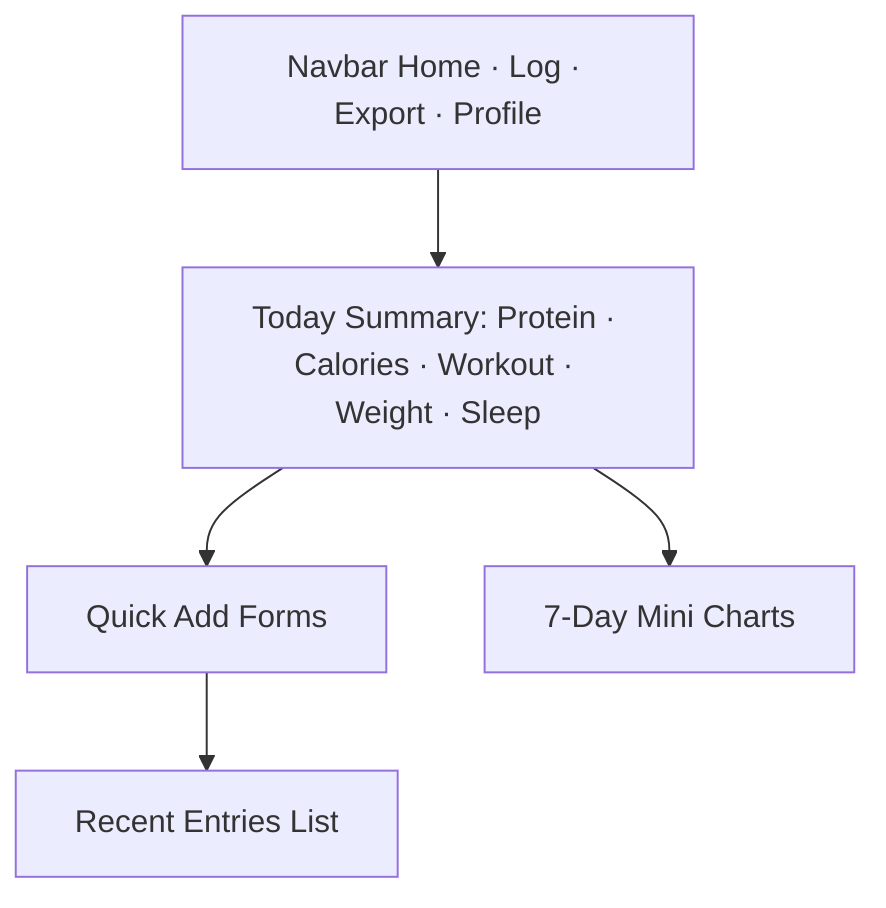

# StrideBite — Daily Fitness & Meal Tracker

StrideBite is a simple personal fitness tracker where users can log workouts, meals, bodyweight, sleep, and private progress photos.
I built this project to explore how daily habits affect long-term progress and to practice secure, privacy-focused app design.

---

## Project Summary

StrideBite supports:

- Logging workouts (running, strength, treadmill sessions)
- Recording meals with protein and calories
- Tracking bodyweight over time
- Entering daily sleep hours
- Uploading private progress photos

The goal is to keep everything lightweight and easy to use so users can build consistency without distractions, ads, or subscriptions.

---

## Getting Started

You can run StrideBite either locally or using Docker.

---

## Option A — Run Locally

### 1. Create a virtual environment and install dependencies
```bash
python -m venv .venv
source .venv/bin/activate
pip install -r requirements.txt
```

### 2. Run the development server
```bash
python manage.py migrate
python manage.py runserver
```

Visit: http://127.0.0.1:8000

---

## Option B — Run with Docker

### 1. Build and start the containers
```bash
docker-compose up --build
```

### 2. Run migrations
```bash
docker compose exec web python manage.py migrate
```

Your app will run at: http://localhost:8000

---

## System Diagrams (Mermaid)

### 1. Dashboard Mockup


### 2. Log Meal Flow
```mermaid
flowchart TD
A[Open Log Meal Page] --> B[Enter Food Name]
B --> C[Protein (g)]
C --> D[Calories]
D --> E[Time]
E --> F[Save Meal]
F --> G[Return to Dashboard]
```

### 3. Log Workout Flow
```mermaid
flowchart TD
A[Open Log Workout Page] --> B{Workout Type}
B --> C1[Run]
B --> C2[Strength]
B --> C3[Treadmill]
C1 --> D[Distance/Duration]
C2 --> D
C3 --> D
D --> E[RPE (1–10)]
E --> F[Save Workout]
```

### 4. C4 Architecture Overview
```mermaid
flowchart LR
User --> Browser
Browser --> WebApp[Django App (Views + REST API)]
WebApp --> DB[(Postgres/SQLite)]
WebApp --> Media[(Local Media Storage)]
WebApp --> Services[Business Logic]
Services --> Models[Django Models]
```

---

## AI Use Disclosure

### 1. Tools and Usage Summary
- Documentation support: I used ChatGPT to organize text and check grammar.
- Diagram formatting: Mermaid diagrams were generated following my layout instructions.
- Debugging assistance: AI was used to analyze error messages, but all implementation logic is my own.

### 2. Nature of Prompts
- Documentation prompts: “Help refine this summary,” “Convert this list into clearer markdown.”
- Diagram prompts: “Format this workflow diagram in Mermaid syntax.”
- Debugging prompts: “Why is this Django error occurring?” “Explain why this variable is returning null.”

### 3. Ownership Statement
While AI helped with formatting, diagram layout, and debugging guidance, the project's code, structure, and design decisions are entirely my own.
