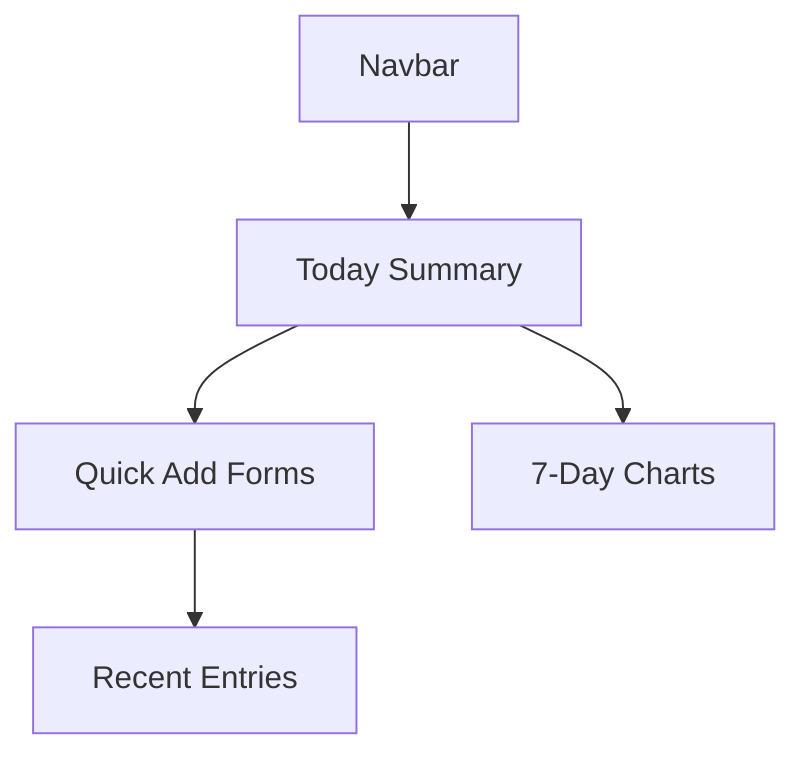
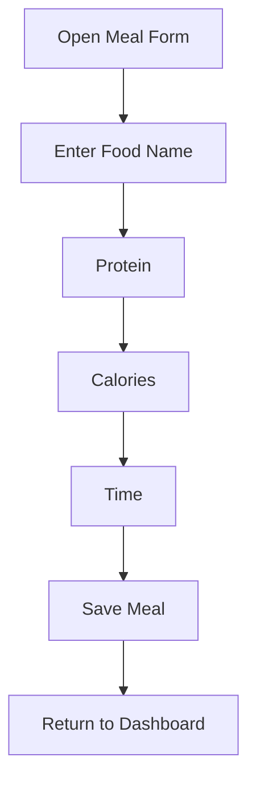
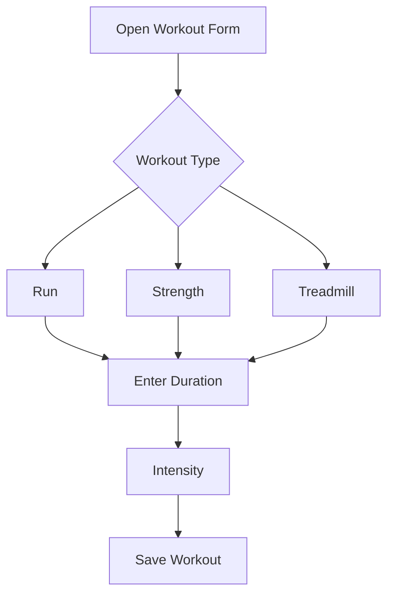

# StrideBite — Daily Fitness & Meal Tracker

StrideBite is a personal fitness and nutrition tracking application built using Django and Django REST Framework.
Users can log workouts, meals, bodyweight, sleep, and review weekly summaries.
The goal of the project is to demonstrate secure application design, Django development, API implementation, and containerized deployment.

---

## Project Summary

StrideBite provides the following core features:

- Logging workouts such as running, strength training, and treadmill sessions
- Recording meals with protein, calories, and timestamps
- Tracking bodyweight daily
- Recording sleep hours
- Viewing recent logs and weekly summaries

The application is designed to be lightweight, private, and easy to use.

---

## Getting Started

StrideBite can run either locally using a virtual environment or inside a Docker container.

---

## Option A — Run Locally

### Create virtual environment and install dependencies
```bash
python -m venv .venv
source .venv/bin/activate
pip install -r requirements.txt
```

### Run development server
```bash
python manage.py migrate
python manage.py runserver
```

Open the site at:
http://127.0.0.1:8000

---

## Option B — Run with Docker

### Build and start container
```bash
docker build -t stridebite .
docker run -p 8000:8000 stridebite
```

### Run migrations inside container
```bash
docker exec -it <container_id> python manage.py migrate
```

The app will run at:
http://localhost:8000

---

## System Diagrams (Mermaid)

The following diagrams illustrate some of the user flows and system layout.

### Dashboard structure


### Meal logging flow


### Workout logging flow


### Architecture overview
```mermaid
flowchart LR
User --> Browser
Browser --> WebApp[Django App (Views + REST API)]
WebApp --> DB[(Postgres or SQLite)]
WebApp --> Media[(Local Storage)]
WebApp --> Services[Business Logic]
Services --> Models[Django Models]
```

---

## API Overview (v1)

Base URL:
`/api/v1/`

### Meal Endpoints
- GET /meals/
- POST /meals/
- GET /meals/{id}/
- PUT /meals/{id}/
- DELETE /meals/{id}/

### Workout Endpoints
- GET /workouts/
- POST /workouts/
- GET /workouts/{id}/
- PUT /workouts/{id}/
- DELETE /workouts/{id}/

Example request:
```bash
curl -X GET http://127.0.0.1:8000/api/v1/meals/
```

---

# Milestone 2 Summary (Implementation, Hardening, Deployment)

This section summarizes the work completed for Milestone 2.

## Implementation

- Added Django models, views, and serializers for meals and workouts
- Completed CRUD operations for both features
- Applied per-user scoping to ensure users cannot access one another’s data
- Implemented serializer and model validation
- Improved templates for adding and editing entries

## Application Hardening

Environment-based configuration was added to improve security:

- DJANGO_SECRET_KEY
- DJANGO_DEBUG
- DJANGO_ALLOWED_HOSTS
- POSTGRES_DB
- POSTGRES_USER
- POSTGRES_PASSWORD
- POSTGRES_HOST
- POSTGRES_PORT

This ensures no secrets are stored in source control.

## Container Hardening

A secure, production-ready Dockerfile was implemented:

- Minimal python:3.12-slim base image
- Installation of required dependencies only
- Removal of package manager caches
- Disabled Python bytecode creation
- Disabled pip caching
- Added non-root runtime user
- Switched to Gunicorn for production serving
- Added Docker health check using Django deployment checks

## Deployment Preparation (EC2)

The project now supports cloud deployment:

- EC2 instance setup with Docker
- Repository cloning and image building
- Running the application with required environment variables
- Security group configured for only necessary ports
- Server accessible on port 8000

## Summary

Milestone 2 delivered a fully functional backend, enhanced application security, hardened container setup, and a deployable cloud-ready environment.
The project now follows secure development practices and is suitable for production-style deployment.

---

## AI Use Disclosure

AI assistance was used only for:

1. Documentation clarification  
2. Formatting diagrams  
3. Debugging explanations related to Django errors  
4. Improving organization of written content  
5. Help with HTML files

All models, views, serializers, business logic, URL routing, and project structure were written by me minimal help of ChatGPT.
