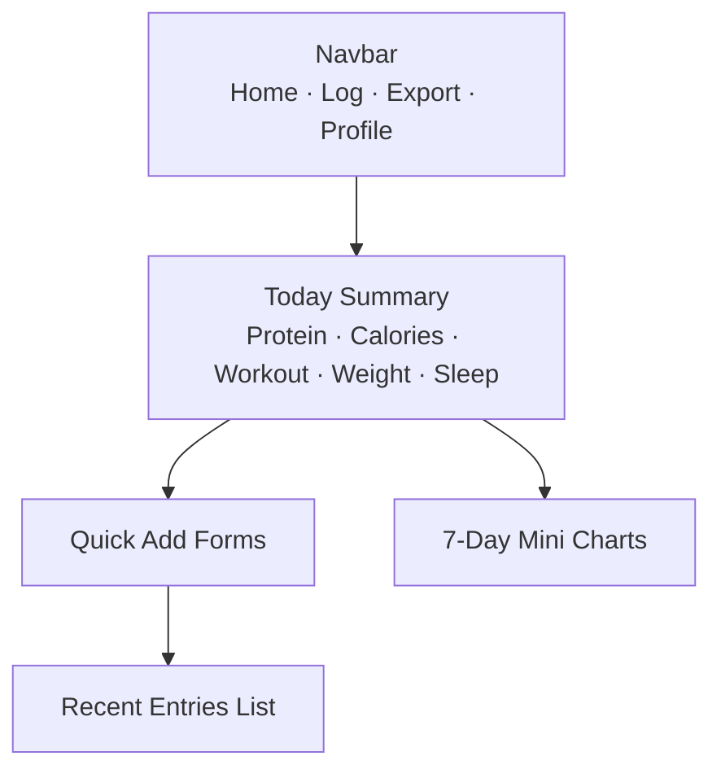
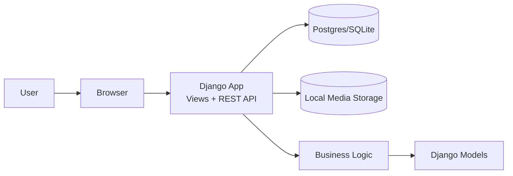

# StrideBite — Daily Fitness & Meal Tracker

StrideBite is a simple personal fitness tracker where users can log workouts, meals, bodyweight, sleep, and private progress photos.
I built this project to explore how daily habits affect long-term progress and to practice secure, privacy-focused app design.

---

## Project Summary

StrideBite supports:

- Logging workouts (running, strength, treadmill sessions)
- Recording meals with protein and calories
- Tracking bodyweight over time
- Entering daily sleep hours
- Uploading private progress photos

The goal is to keep everything lightweight and easy to use so users can build consistency without distractions, ads, or subscriptions.

---

## Getting Started

You can run StrideBite either locally or using Docker.

---

## Option A — Run Locally

### 1. Create a virtual environment and install dependencies
```bash
python -m venv .venv
source .venv/bin/activate
pip install -r requirements.txt
```

### 2. Run the development server
```bash
python manage.py migrate
python manage.py runserver
```

Visit: http://127.0.0.1:8000

---

## Option B — Run with Docker

### 1. Build and start the containers
```bash
docker-compose up --build
```

### 2. Run migrations
```bash
docker compose exec web python manage.py migrate
```

Your app will run at: http://localhost:8000

---

## System Diagrams (Mermaid)

### 1. Dashboard Mockup


### 2. Log Meal Flow
```mermaid
flowchart TD
A[Open Log Meal Page] --> B[Enter Food Name]
B --> C[Protein (g)]
C --> D[Calories]
D --> E[Time]
E --> F[Save Meal]
F --> G[Return to Dashboard]
```

### 3. Log Workout Flow
```mermaid
flowchart TD
A[Open Log Workout Page] --> B{Workout Type}
B --> C1[Run]
B --> C2[Strength]
B --> C3[Treadmill]
C1 --> D[Distance/Duration]
C2 --> D
C3 --> D
D --> E[RPE (1–10)]
E --> F[Save Workout]
```

### 4. C4 Architecture Overview


## 5. AI Use Disclosure

In accordance with the course AI policy, I am providing the following description of how AI tools
(ChatGPT) were used during the completion of this milestone.

### 1. Tools and Usage Summary

Documentation and planning:  
I used AI to help reorganize and clean up some of the user stories, the project summary.

Design assistance:  
AI was used to help format Mermaid diagrams for the UI mockups and architecture. The diagrams are
based on my descriptions and layout instructions, but the tool helped format the syntax correctly.

Development assistance:  
I wrote the code for the project myself, including models, views, URLs, templates, and configuration.
AI was used as a debugging helper when errors came up, such as migration issues or Django import
problems. I provided the error messages, and AI explained how to fix them.

### 2. Nature of Prompts

Examples of the types of prompts I used:

- Help me rewrite this project summary in clearer wording.
- Convert this description into a Mermaid diagram.
- Why is this Django view or URL causing an error?
- Explain this migration error and how to resolve it.

### 3. Ownership Statement

AI was used to improve clarity, help with formatting diagrams, and assist with debugging.  
All coding decisions, project structure choices, and the implementation of the application were done by me.
